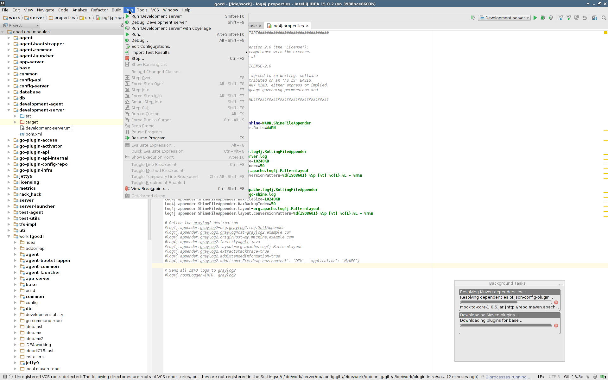
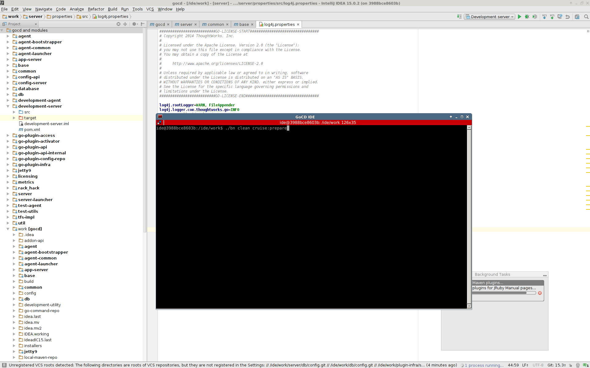

# GoCD workstation in docker

This image is meant for GoCD developers. It aims to have all tools that you need
to contribute to GoCD.

Built on top of [tomzo/gocd-ide](https://github.com/tomzo/docker-gocd-ide), contains
additional tools for human developers:

 * intellij idea 15.02 - IDE for java development
 * terminator - X terminal emulator to execute build commands
 * firefox - for testing the gocd server




## Prerequisites

 * You must be running docker daemon **locally**.
 * You must be running X server on docker host and allow docker to use that with
```
xhost +
```

## Quickstart

Clone gocd from github (not so quick)
```
git clone git@github.com:gocd/gocd.git
```
Start container with all tools and configuration that you need.
```
docker run -v /tmp/.X11-unix:/tmp/.X11-unix -v `pwd`/gocd:/ide/work -v ~:/ide/identity:ro -e DISPLAY="unix:0.0" tomzo/gocd-workstation
```
2 windows should pop up at you - a terminal titled `GoCD IDE` and Intellij IDEA
with configured and opened gocd project.

## Using with docker

You can start docker in **non-interactive** mode
```
docker run -v /tmp/.X11-unix:/tmp/.X11-unix -v ~/code/gocd:/ide/work -v ~:/ide/identity:ro -e DISPLAY="unix:0.0" tomzo/gocd-workstation
```
This will open intellij and terminator.

You can also start docker in **interactive** mode.
```
docker run -ti -v /tmp/.X11-unix:/tmp/.X11-unix -v ~/code/gocd:/ide/work -v ~:/ide/identity:ro -e DISPLAY="unix:0.0" tomzo/gocd-workstation
```

This will put you in the container in `bash` shell.
All tools from [gocd IDE image](https://github.com/tomzo/docker-gocd-ide)
 are available, for example:

```
go-compile         # compiles all source code mounted in /ide/work
go-build-installer # builds gocd packages from source code in /ide/work
```

+ you can start intellij with

```
intellij &
```

## Using with docker-compose (and dockerstation)

Add this to your `docker-compose.yml`
```
gocd:
  image: tomzo/gocd-workstation
  container_name: gocdide
  mem_limit: 4096M # recommended
  environment:
    DISPLAY: unix:0.0
  stdin_open: false
  tty: false
  volumes:
   - /tmp/.X11-unix:/tmp/.X11-unix
   - /home/tomzo/code/gocd:/ide/work
   - /home/tomzo:/ide/identity:ro
```
